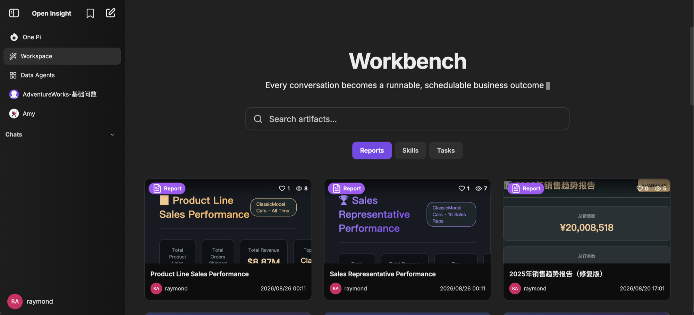
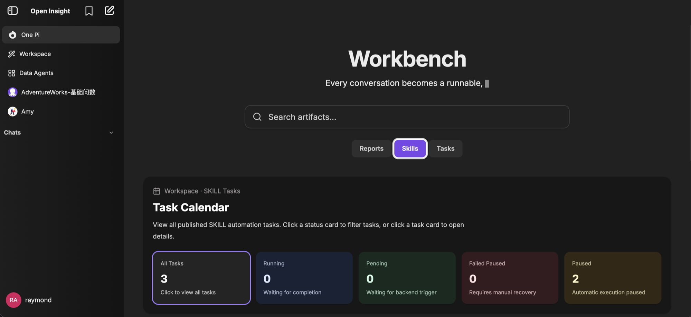

<h1 align="center">ARP — Agent Runtime Platform</h1>

<p align="center">
  The open-source runtime that powers AI employees.<br/>
  Connect any model, any tool, any enterprise system — on your own infrastructure.
</p>

<p align="center">
  <a href="#license">
    
  </a>
  <a href="https://nodejs.org">
    
  </a>
  <a href="https://github.com/OpenInsightHQ/arp/releases">
    
  </a>
</p>

---

## What is ARP?

ARP is an enterprise-grade, self-hosted **agent runtime**. It is where AI employees
actually run: multi-provider LLM access, no-code agents, MCP tool servers,
generative UI, sandboxed code execution, and enterprise-grade access control —
deployed on your own servers.

ARP is one component of the Open Insight platform:

| Component | Role |
| --- | --- |
| [openinsight](https://github.com/OpenInsightHQ/openinsight) | One-command deployment & release entry |
| **ARP** (this repo) | Agent runtime — where AI employees run |
| [one-pi](https://github.com/OpenInsightHQ/one-pi) | Enterprise agent platform — expert agents & orchestration |

---

## Why ARP?

- **Any model** — OpenAI, Anthropic, Google, Azure, Bedrock, Vertex AI, and any
  OpenAI-compatible endpoint (GLM, Qwen, DeepSeek, Kimi, Ollama, …).
- **Any tool** — MCP tool servers, sandboxed code interpreter, web search,
  image generation.
- **Enterprise-ready access** — OAuth2, OpenID, SAML, LDAP, email login, plus
  an automatic JWT-based SSO layer.
- **Self-hosted** — your infrastructure, your data, no vendor lock-in.
- **Built for AI employees** — integrates with ONE-PI (agent platform) and DMP
  (enterprise data & governance) to ground agents in your business.

---

## Screenshots

<p align="center">
  
</p>

<p align="center">
  
</p>

---

## Architecture

| Layer | Path | What it does |
| --- | --- | --- |
| Web client | `/client` | React front-end — chat, agents, artifacts, presets |
| API server | `/api`, `/packages/api` | REST & streaming API, auth, integrations |
| Shared packages | `/packages/*` | `data-provider`, `data-schemas`, shared utils |
| Configuration | `librechat.yaml` | Endpoints, MCP servers, interface options |
| Deployment | `docker-compose.yml`, `deploy-compose.yml`, `helm/` | Docker, Compose, Helm |

---

## Features

- **Multi-provider chat**: OpenAI, Anthropic, Google, Azure, AWS Bedrock, Vertex AI,
  and any OpenAI-compatible endpoint (Ollama, DeepSeek, GLM, Qwen, Kimi, …).
- **Agents & MCP**: no-code custom agents, Model Context Protocol tool servers,
  agent marketplace, and remote agent sharing.
- **Generative UI / Artifacts**: React, HTML, and Mermaid diagrams rendered in chat.
- **Code Interpreter API**: sandboxed Python, Node, Go, C/C++, Java, Rust, and more.
- **Multimodal & files**: image understanding, file chat, SharePoint picker.
- **Multilingual UI** with reasoning-model support.
- **Multi-user, secure access**: OAuth2, OpenID, SAML, LDAP, email login, plus
  the automatic SSO layer.
- **Enterprise layer**: DMP integration (user lookup, agent context, MCP tool
  bridge), UI watermarks, branded Sandpack artifacts, custom endpoint presets.
- **Resumable streams**, conversation search, presets, message branching, import/export.

---

## Quick Start

### Prerequisites

- Node.js **v20.19.0+** / **^22.12.0** / **>= 23.0.0**
- MongoDB
- (Optional) Meilisearch, Redis

### 1. Configure environment

```bash
cp .env.example .env
```

Open `.env` and fill in at least:

- `MONGO_URI`
- `JWT_SECRET`, `JWT_REFRESH_SECRET` (generate with
  `node -e "console.log(require('crypto').randomBytes(48).toString('hex'))"`)
- `CREDS_KEY`, `CREDS_IV` (see `.env.example` for generation commands)
- Any model-provider keys you plan to use

ARP-specific variables (DMP, AUTO_SSO, WATERMARK, SANDPACK, CSP, PI, …) are
documented in the **OpenInsight Extensions** section at the bottom of `.env.example`.

### 2. Configure endpoints (optional)

```bash
cp librechat.example.yaml librechat.yaml
```

Edit `librechat.yaml` to define custom endpoints, MCP servers, and interface options.
See `librechat.example.yaml` for all available settings.

### 3. Install & run

```bash
npm run smart-reinstall   # install deps + build workspaces
npm run backend           # start the API server on :3080
```

In a second terminal:

```bash
npm run frontend:dev      # Vite dev server on :3090
```

Or run everything with Docker:

```bash
docker compose up -d
```

---

## Development

| Command | Purpose |
| --- | --- |
| `npm run backend:dev` | Start backend with file watching |
| `npm run frontend:dev` | Start frontend dev server (HMR) |
| `npm run build` | Build all workspaces via Turborepo |
| `npm run build:data-provider` | Rebuild `packages/data-provider` after edits |
| `npm run lint` / `npm run lint:fix` | ESLint |
| `npm run format` | Prettier |
| `npm run test:all` | Run all workspace tests |

Monorepo layout: `/api` (legacy JS backend), `/packages/api` (new TS backend),
`/packages/data-schemas`, `/packages/data-provider` (shared), `/client` (frontend),
`/packages/client` (shared frontend utils).

---

## Roadmap

- **v1.0** — first public release, production-ready deployment via
  [openinsight](https://github.com/OpenInsightHQ/openinsight)
- Deeper ONE-PI integration — expert agents, skills, orchestration
- More enterprise connectors and identity providers
- Community agent & MCP templates

---

## Contributing

Bug reports, feature ideas, and pull requests are welcome!

- 🐛 [Report a bug](https://github.com/OpenInsightHQ/arp/issues/new?template=bug_report.md) · 💡 [Suggest a feature](https://github.com/OpenInsightHQ/arp/issues/new?template=feature_request.md)
- Setup & guidelines: [CONTRIBUTING.md](CONTRIBUTING.md)
- Security vulnerabilities: see [SECURITY.md](SECURITY.md) — please do not open public issues

---

## Built on LibreChat

> ℹ️ Technical note: ARP is built on a fork of
> [LibreChat](https://github.com/danny-avila/LibreChat). Upstream features and
> general usage are inherited from it.

ARP would not exist without the outstanding work of
**[Danny Avila](https://github.com/danny-avila)** and the LibreChat contributors.

---

## License

Released under the [Apache-2.0 License](LICENSE).

> Portions of this project derive from [LibreChat](https://github.com/danny-avila/LibreChat)
> (MIT, © 2023 Danny Avila and LibreChat contributors).
